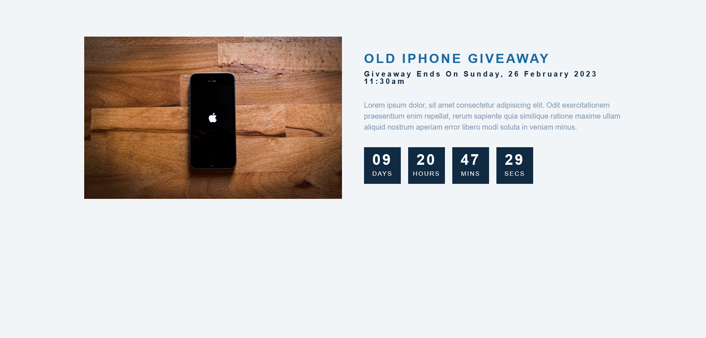

<h1 align="center">Countdown Timer</h1>

It's a JS mini project for practice.

This project was a good practice for Date() subject.
In this project I've learnt about how to get remain time between now and specific time and how to set them in a countdown timer;

### Built With

built with html, css, pure js.
